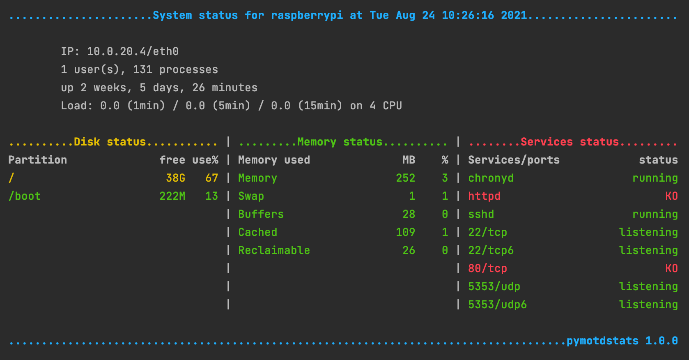

# pymotdstats

pymotdstats (Message of the day and simple system status), inspired by
[MOTDstat](https://www.gelogic.net/motdstat/) and written in python 3.6,
prints an overview of system utilisation and performance when you log in.

Monitored values:

- Default interface name and its IP address;
- Number of connected users;
- Number of running processes;
- System uptime;
- System load for 1 minute, 5 minutes and 15 minutes;
- Number of CPU;
- Disk usage for each partition: free space size and percent used;
- Memory usage: free space size and percent free of Memory, Swap, Buffers,
  Cached, Reclaimable;
- Running services status;
- Listening ports status.

You can:

- define columns size;
- define max lines to print;
- define warning and critical thresholds;
- define services to check;
- define ports (tcp, tcp6, udp, udp6) to check;
- ignore some partitions to check.

## Dependencies

You need at least python 3.6.

## Installation

Just put `pymotdstats.py` into `/usr/local/bin/`, set exec permission and root
owner.

    \cp -v pymotdstats.py /usr/local/bin/
    \chmod -c 755 /usr/local/bin/pymotdstats.py
    \chown -c root. /usr/local/bin/pymotdstats.py

Copy `etc/pymotdstats.ini` into `/etc/`, set 644 permissions and root owner.

    \cp -v etc/pymotdstats.ini /etc/
    \chmod -c 644 /etc/pymotdstats.ini
    \chown -c root. /etc/pymotdstats.ini

Edit `/etc/pymotdstats.ini` and tweak it to your needs.

### Shell mode

You can call `pymotdstats.py` from your bashrc. Just put this line into your
`$HOME/.bashrc` file:

    /usr/local/bin/pymotdstats.py

This is the easy way, with variable column size. But the script is executed on
each opened terminal window. This can add a little more time when you log in.

### Cron mode

Better way, use cron to generate `/etc/motd` file every 5 minutes, for example.

    echo '*/5 * * * * root /usr/local/bin/pymotdstats.py > /etc/motd' > /etc/cron.d/pymotdstats

The login process is faster, but you don't get the last updated value.
You can decrease the cron interval, if you want to get more fresh value.

Please note that the motd doesn't show on multiplexed ssh connections,
	   only on the first session that also does the authentication.

#### On Debian family

You just have to remove `/etc/update-motd.d/` directory.
This disables running these scripts with `pam_motd`. We just want the
pymotdstats output.

    rm -rfv /etc/update-motd.d/

#### On CentOS and others

You need to set the ssh configuration to print the motd file when you log in.

Edit `/etc/ssh/sshd_config` and enable print motd:

    PrintMotd yes

You may also want to remove the last log line:

    PrintLastLog no

Then restart your ssh server:

    service sshd restart

## Support and evolution

Feel free to send a pull request or open an issue.
The purpose of this tool is just to print something on the screen, not to send
email or doing something else.

## License

Released under GPLV3 license.
